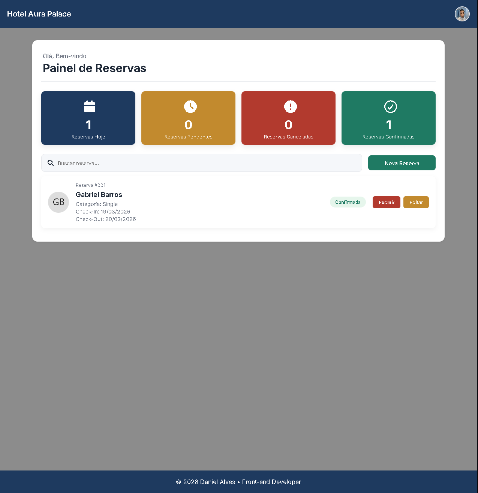

# hotel-reservations-dashboard
🏨 Sistema de Reservas de Hotel

Aplicação web para gerenciamento de reservas, permitindo cadastrar, editar, excluir e filtrar hóspedes de forma simples e intuitiva.

---

🚀 Demonstração

🔗 Acesse o projeto:
👉 https://danielalves5612.github.io/hotel-reservations-dashboard/

---

📌 Funcionalidades

- ✅ Criar nova reserva
- ✏️ Editar reservas existentes
- ❌ Excluir reservas
- 🔍 Filtrar reservas em tempo real
- 📊 Resumo de status (confirmadas, pendentes, canceladas)
- 🧾 Validação de CPF
- 🚫 Bloqueio de CPF duplicado
- 💾 Persistência de dados com LocalStorage
- 🖼️ Avatar automático baseado no nome
- 📱 Layout responsivo (mobile first)

---

🧠 Tecnologias utilizadas

- HTML5
- CSS3 (Mobile First + Responsivo)
- JavaScript (ES Modules)
- LocalStorage

---

🧩 Arquitetura do Projeto

📁 modules
 ├── reservas.js   → lógica principal (estado + eventos)
 ├── ui.js         → manipulação de interface (DOM)
 ├── storage.js    → persistência de dados
 ├── filtros.js    → lógica de busca
 └── validaCPF.js  → validação de CPF

---

⚙️ Como executar o projeto

git clone https://https://github.com/danielalves5612/hotel-reservations-dashboard
cd hotel-reservations-dashboard

Depois, abra o arquivo "index.html" no navegador.

---

🎯 Objetivo do projeto

Este projeto foi desenvolvido com foco em:

- Praticar JavaScript na prática
- Trabalhar com manipulação de DOM
- Aplicar conceitos de modularização
- Simular um sistema real com CRUD
- Preparação para o mercado de trabalho

---

📸 Preview

---

📈 Melhorias futuras

- 🔐 Sistema de login/autenticação
- 🌐 Integração com API/backend
- 🗄️ Banco de dados (Node + MySQL/Mongo)
- 📅 Validação de datas mais robusta
- 🎨 Melhorias visuais (UI/UX)

---

👨‍💻 Autor

Desenvolvido por Daniel Alves

---

⭐ Considerações

Projeto desenvolvido com foco em evolução prática.
Cada etapa foi pensada para simular problemas reais enfrentados no desenvolvimento front-end.
